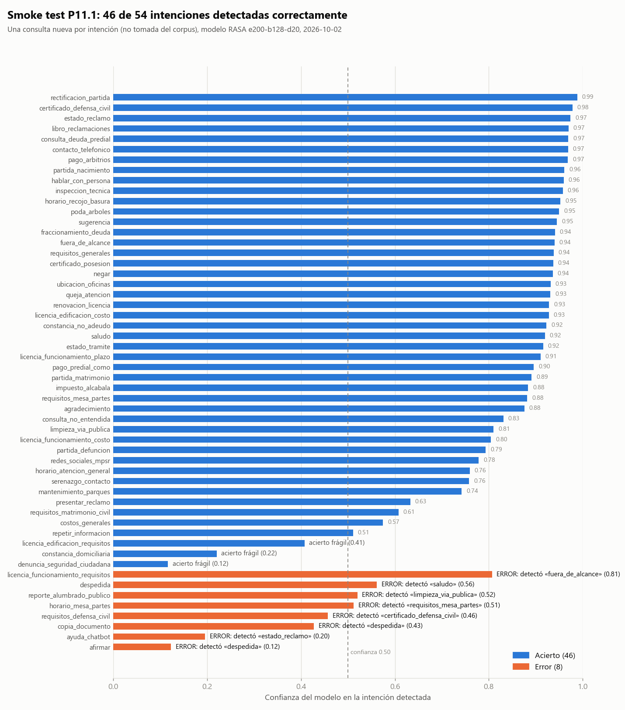
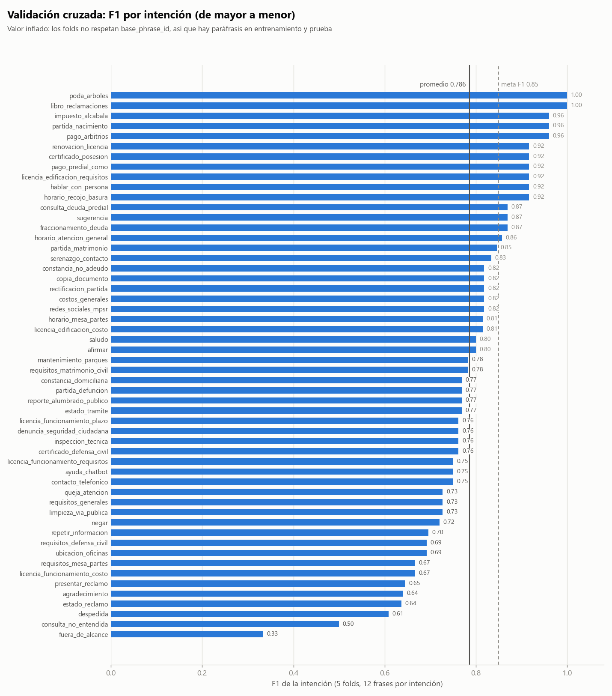

# Reporte de fallas — P11.1 (smoke test y validación cruzada)

Fecha: 2026-10-02 · Corpus v2 (648 utterances, 54 intenciones) · Modelo `RASA-e200-b128-d20`
(epochs=200, batch=128, embedding=20, seed 42) entrenado con `domain.yml` de 54 respuestas.

## 1. Resumen

| Prueba | Resultado |
|---|---|
| `rasa data validate` | Sin conflictos |
| Smoke test (54 consultas nuevas, 1 por intención) | **46/54 intenciones correctas (85 %)**, 8 errores, 3 aciertos frágiles (confianza < 0.50) |
| Respuesta del bot = texto de `domain.yml` | 54/54 |
| Problemas de formato en las respuestas (incl. notas `[Verificar]`) | 0/54 |
| Validación cruzada (5 folds, corpus completo) | F1 0.778 ± 0.028, exactitud 0.789 ± 0.027 — **inflado**, ver §6 |

Las fallas están en la **clasificación de intenciones**, no en las respuestas: cuando el modelo
acierta la intención, el texto siempre es el correcto. Cuando falla, el ciudadano recibe la
respuesta de *otro* trámite (o un "no puedo ayudarte") sin ninguna señal de que hubo un error.

## 2. Figuras

Matriz de confusión de la validación cruzada (generada por Rasa):
[`logs/P11_1_crossval/intent_confusion_matrix.png`](../../logs/P11_1_crossval/intent_confusion_matrix.png) ·
Histograma de confianza: [`intent_histogram.png`](../../logs/P11_1_crossval/intent_histogram.png)

## 3. Las 8 intenciones mal clasificadas

Ordenadas por confianza del modelo. "Palabras nuevas" = palabras de la consulta que no aparecen
en ninguna frase de entrenamiento (tras normalizar tildes y mayúsculas).

| # | Intención esperada | Consulta | Detectó (confianza) | Palabras nuevas | Lo que respondería el bot |
|---|---|---|---|---|---|
| 1 | `afirmar` | «dale adelante» | `despedida` (0.12) | *dale, adelante* | «¡Gracias por tu consulta! Que tengas un buen día.» |
| 2 | `ayuda_chatbot` | «¿en qué me puedes colaborar?» | `estado_reclamo` (0.20) | *colaborar* | «El estado de tu reclamo puede consultarse en mesa de partes…» |
| 3 | `copia_documento` | «me pueden dar copia de un documento que ya presenté» | `despedida` (0.43) | *pueden, dar* | «¡Gracias por tu consulta! Que tengas un buen día.» |
| 4 | `requisitos_defensa_civil` | «qué piden para el tema de defensa civil» | `certificado_defensa_civil` (0.46) | *tema* | Cómo tramitar el certificado de Defensa Civil (no sus requisitos) |
| 5 | `horario_mesa_partes` | «hasta qué hora recibe documentos mesa de partes» | `requisitos_mesa_partes` (0.51) | *recibe* | Requisitos para presentar un documento (no el horario) |
| 6 | `reporte_alumbrado_publico` | «el poste de mi calle no prende hace días» | `limpieza_via_publica` (0.52) | *prende, hace* | Cómo solicitar limpieza de una calle |
| 7 | `despedida` | «bueno me despido cuídese» | `saludo` (0.56) | *despido, cuidese* | «¡Hola! Soy el asistente virtual de la MPSR…» |
| 8 | `licencia_funcionamiento_requisitos` | «qué documentos necesito para abrir mi restaurante» | `fuera_de_alcance` (**0.81**) | ninguna | «Soy un asistente especializado… no puedo ayudarte con eso.» |

Aciertos frágiles (la intención es correcta pero la confianza es baja): `denuncia_seguridad_ciudadana`
(0.12, palabras nuevas: *unos, sujetos, sospechosos, cuadra, aviso*), `constancia_domiciliaria` (0.22)
y `licencia_edificacion_requisitos` (0.41).

## 4. Causas probables (con la evidencia que las respalda)

1. **Vocabulario ausente del entrenamiento.** 7 de las 8 fallas contienen palabras que el modelo
   nunca vio (*dale, colaborar, prende, recibe, despido…*). Es normal en lenguaje coloquial; el
   corpus no incluye jerga local (`configs/jerga_local.csv` sigue vacío).
2. **Una sola palabra arrastró la clasificación (falla 8, la más grave).** «restaurante» aparece
   **una vez** en todo el entrenamiento, dentro de un ejemplo de `fuera_de_alcance`
   («¿Me recomiendas un restaurante?»). Esa palabra bastó para clasificar con 0.81 de confianza una
   consulta central de licencias como "fuera de alcance". Las frases de licencia de funcionamiento
   solo mencionan «negocio», «tienda» y «local», sin otros giros (bodega, hotel, botica…).
3. **Poca variedad real en los datos de entrenamiento.** De los 396 ejemplos de entrenamiento de
   las 44 intenciones de trámites, **204 (52 %) son plantillas** (`expand_corpus.py` aplica las mismas
   6 plantillas a todas las intenciones con la misma frase del trámite) y solo 192 son frases
   naturales (unas 4 por intención). El modelo ve mucho la misma estructura y poca diversidad.
4. **Intenciones vecinas que se distinguen por una palabra** (fallas 4, 5 y 6): *horario* vs.
   *requisitos* de mesa de partes, *requisitos* vs. *certificado* de Defensa Civil, *alumbrado*
   vs. *limpieza* de la vía pública. Comparten casi todo el vocabulario («mesa de partes»,
   «Defensa Civil», «calle»); la palabra decisiva era nueva o poco frecuente.
5. **Intenciones conversacionales con muy pocos ejemplos cortos** (fallas 1 y 7; la 3 es un trámite
   que se fue a `despedida`). Son frases de 1 a 4 palabras, y `afirmar`, `despedida`, `saludo` y `agradecimiento` se parecen entre sí. En la
   validación cruzada `fuera_de_alcance` (0.33), `consulta_no_entendida` (0.50) y `despedida` (0.61)
   son las peores intenciones.
6. **No hay red de seguridad.** El pipeline no incluye `FallbackClassifier`: el bot siempre
   responde con la intención más probable, aunque la confianza sea 0.12. Cuatro de los ocho
   errores tenían confianza < 0.50.

## 5. Recomendaciones (ordenadas por impacto esperado)

| # | Acción | Qué corrige | Nota |
|---|---|---|---|
| 1 | Agregar un `FallbackClassifier` (umbral de confianza) que responda `utter_consulta_no_entendida` | Falla de "responde otra cosa con seguridad falsa" (causa 6) | Con umbral 0.50 en este smoke test: 4/8 errores pasarían a "no entendí", a costa de 3/46 aciertos; con 0.55: 6/8 errores y 4/46 aciertos. **El umbral debe elegirse con validación, no con estos datos.** No arregla la falla 8 (0.81). |
| 2 | Agregar frases reales de ciudadanos (piloto P12/P13, estudios contables) con su vocabulario y jerga | Causas 1 y 3 | Es la mejora de mayor valor; ver `incident_log.csv` sobre las plantillas |
| 3 | Reforzar `fuera_de_alcance` con ejemplos variados (no solo comida/clima) y agregar giros de negocio a las licencias (restaurante, bodega, hotel, botica…) | Causa 2 | Revisar que ninguna palabra de trámites quede asociada solo a `fuera_de_alcance` |
| 4 | Agregar 3–5 ejemplos que contrasten las intenciones vecinas (horario vs. requisitos, requisitos vs. certificado, alumbrado vs. limpieza) | Causa 4 | Frases cortas centradas en la palabra decisiva |
| 5 | Ampliar las intenciones conversacionales con más expresiones locales («dale», «ya pues», «chau») | Causa 5 | Llenar `configs/jerga_local.csv` |
| 6 | Repetir el smoke test con ≥ 3 consultas por intención y la validación cruzada con folds agrupados por `base_phrase_id` | Medir con menos azar y sin fuga | Requiere un script de folds agrupados |

Cualquier cambio al corpus obliga a repetir partición, entrenamiento y evaluación, y a registrarlo
en `incident_log.csv`; ajustar umbrales o ejemplos mirando el conjunto de prueba viola la regla 3.1
del protocolo.

## 6. Limitaciones de esta evidencia

- **Es una prueba técnica de 54 consultas**, una por intención y redactadas por la herramienta
  (no por ciudadanos reales). Un caso por intención da una idea cualitativa, no un intervalo de
  confianza: 46/54 podría ser 40/54 o 50/54 con otras redacciones.
- **El F1 de la validación cruzada (0.778) está inflado.** Los folds de Rasa no respetan
  `base_phrase_id`, de modo que paráfrasis del mismo grupo quedan en entrenamiento y en prueba. La
  estimación honesta de generalización es la de la partición agrupada de P11: **F1 macro 0.6335**.
  Además la validación cruzada usó la configuración base (epochs=100), no la ganadora.
- Las respuestas del bot **no están validadas con el TUPA real de la MPSR** (ver `p09_domain/`).
- `rasa shell` no se pudo usar (es interactivo); el recorrido se hizo con `scripts/smoke_test.py`.

## 7. Archivos

| Archivo | Contenido |
|---|---|
| `logs/P11_1_smoke_test/smoke_test_results.csv` | Las 54 consultas: intención detectada, confianza, top-3, respuesta |
| `logs/P11_1_smoke_test/smoke_test_resumen.txt` | Resumen del smoke test |
| `logs/P11_1_crossval/` | Reporte por intención, errores, matriz de confusión e histograma |
| `tests/smoke_test_queries.csv` | Las 54 consultas usadas |
| `scripts/smoke_test.py`, `scripts/plot_p11_1.py` | Código que genera los resultados y las figuras |
| `salidas/`, `capturas/` | Salida de consola y captura de cada ejecución |
