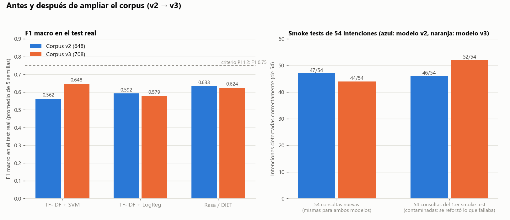
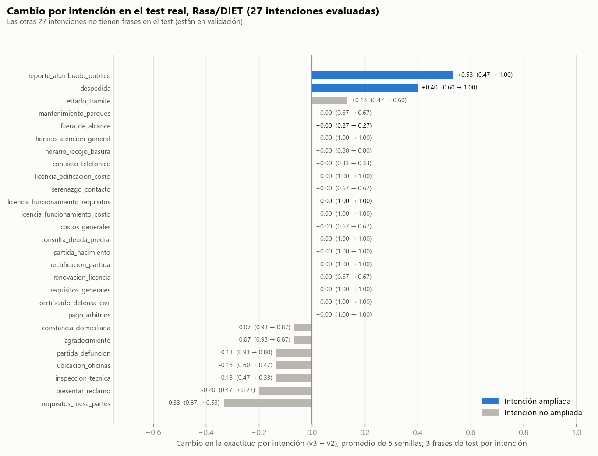

# Re-evaluación de P11.1 con el corpus ampliado (v3)

Fecha: 2026-10-02 · Corpus v3 (708 utterances, 54 intenciones; 546/81/81) · `domain.yml` con 54 respuestas.

## 1. Veredicto

**No se cumplen los criterios de salida de P11.1. No se autoriza el paso a P11.2 (pre-piloto).**

| Criterio | Meta | Resultado | ¿Cumple? |
|---|---|---|---|
| Conflictos en `rasa data validate` | 0 | 0 | ✅ |
| F1 macro en el **test real** | ≥ 0.75 | Rasa/DIET **0.6241 ± 0.0286** · TF-IDF+SVM 0.6480 | ❌ |
| F1 macro en **validación cruzada agrupada** (sin fuga) | ≥ 0.75 | Rasa/DIET **0.6550 ± 0.0479** · SVM 0.6370 ± 0.0509 | ❌ |
| Smoke test, 54 intenciones, consultas nuevas | 54/54 o muy cerca | **44/54 (81 %)** | ❌ |
| (Smoke test con las consultas del 1.er intento) | — | 52/54, pero **contaminado**: se reforzó justo lo que fallaba | no cuenta |

Las dos estimaciones independientes del F1 (test real: 0.62–0.65; validación cruzada agrupada: 0.64–0.66)
coinciden entre sí y quedan 0.10 puntos por debajo de la meta.

## 2. Qué se hizo (plan en 5 pasos)

| Paso | Qué | Evidencia |
|---|---|---|
| 1–3 | 60 frases coloquiales en 20 grupos nuevos para 9 intenciones: `licencia_funcionamiento_requisitos` (+3 grupos), `fuera_de_alcance` (+3, con casi-trámites no municipales), y `afirmar`, `ayuda_chatbot`, `copia_documento`, `despedida`, `horario_mesa_partes`, `reporte_alumbrado_publico`, `requisitos_defensa_civil` (+2 cada una). Todos los grupos nuevos van a `train`; validación y test no cambian | `corpus/ampliacion_v3.csv`, `salidas/00` |
| 4 | Script de validación cruzada agrupada (`scripts/crossval_agrupada.py`, `StratifiedGroupKFold` por `base_phrase_id`) | `salidas/10`, `logs/P11_1_crossval_agrupada/` |
| 5 | Reentrenamiento: auditoría, `rasa data validate`, baseline, **grilla de Rasa completa** (12 combinaciones + 5 semillas), modelo completo para el smoke test, dos smoke tests y comparación con el modelo anterior | `salidas/01`–`09` |

Cuidados para que la comparación sea válida: (a) validación y test no se tocaron; (b) las 54 consultas del primer
smoke test se usaron solo como regresión, y la evaluación honesta usa **54 consultas nuevas**
(`tests/smoke_test_queries_v2.csv`); (c) el modelo anterior se evaluó con esas mismas consultas nuevas.

## 3. Antes y después

| | Corpus v2 (648) | Corpus v3 (708) |
|---|---|---|
| F1 test, TF-IDF + SVM | 0.5621 | **0.6480** |
| F1 test, TF-IDF + LogReg | 0.5919 | 0.5786 |
| F1 test, Rasa/DIET (5 semillas) | 0.6335 ± 0.0238 | 0.6241 ± 0.0286 |
| Mejor F1 en validación, Rasa/DIET | 0.6718 | 0.7650 |
| Smoke test con las 54 consultas nuevas | 47/54 | 44/54 |
| · intenciones ampliadas (9) / no ampliadas (45) | 6/9 · 41/45 | 7/9 · 37/45 |

La ampliación **corrigió lo que apuntaba** (las 8 fallas originales; `licencia_funcionamiento_requisitos`
ya no se confunde con `fuera_de_alcance`; en el test real `reporte_alumbrado_publico` pasó de 0.47 a 1.00 y
`despedida` de 0.60 a 1.00), pero **no mejoró la generalización**: el F1 de Rasa en el test es igual (dentro del
ruido) y el smoke test con consultas nuevas bajó de 47 a 44.

## 4. Por qué no mejoró (con la evidencia de cada causa)

1. **Efecto de rebote entre intenciones vecinas.** Al agregar 6 frases de `horario_mesa_partes` (todas con
   «mesa de partes»), 7 predicciones de `requisitos_mesa_partes` pasaron a `horario_mesa_partes`; antes no
   ocurría. En el test real `requisitos_mesa_partes` cayó de 0.87 a 0.53. Con consultas nuevas el modelo
   nuevo **arregla 4 intenciones y rompe 7** (`afirmar`, `agradecimiento`, `consulta_deuda_predial`,
   `denuncia_seguridad_ciudadana`, `inspeccion_tecnica`, `licencia_edificacion_requisitos`,
   `licencia_funcionamiento_plazo`).
2. **`fuera_de_alcance` no mejoró (0.27 en test, antes y después).** Sus frases de test son de cultura
   general («¿Cuál es la capital de Francia?», «¿Qué partido juega hoy?»); los ejemplos que se agregaron
   (RUC, recibo de luz, DNI, EsSalud) cubren otro tipo de «casi trámite». El límite necesita ambos tipos de
   ejemplos. Con una consulta nueva (pensión de la AFP) sí acertó, pero con confianza 0.37.
3. **El test mide solo 27 de las 54 intenciones y 3 frases de cada una.** De las 9 intenciones ampliadas,
   solo 4 están en el test (`despedida`, `fuera_de_alcance`, `licencia_funcionamiento_requisitos`,
   `reporte_alumbrado_publico`); las otras 5 se miden únicamente en validación. Por eso la validación
   mejoró (0.6718 → 0.7650) y el test no. Cada frase de test vale 1.2 puntos de exactitud, y el F1 de DIET
   varía entre 0.577 y 0.650 según la semilla.
4. **Optimismo de la validación.** La combinación ganadora se elige entre 12 sobre 27 intenciones; la
   brecha validación-test es de 0.14 (0.765 vs 0.624).
5. **El ranking entre métodos no es estable.** En el test, el SVM (0.648) supera a DIET (0.624); en la
   validación cruzada agrupada, DIET (0.655) supera al SVM (0.637). Las diferencias son menores que la
   desviación estándar (0.03–0.05): no se puede declarar a ninguno superior.
6. **Datos sintéticos.** Las frases nuevas las redactó la herramienta (no ciudadanos) y comparten estilo
   con el resto del corpus; la mejora sobre ese mismo estilo puede no trasladarse a consultas reales.

## 5. Validación cruzada agrupada vs. la nativa de Rasa

| | F1 macro | Exactitud |
|---|---|---|
| `rasa test nlu --cross-validation` (corpus v2, folds al azar) | 0.778 ± 0.028 | 0.789 |
| `crossval_agrupada.py` (corpus v3, folds por `base_phrase_id`) — Rasa/DIET | **0.655 ± 0.048** | 0.773 |
| `crossval_agrupada.py` — TF-IDF + SVM | 0.637 ± 0.051 | 0.732 |
| `crossval_agrupada.py` — TF-IDF + LogReg | 0.525 ± 0.080 | 0.599 |

La validación nativa sobreestimaba el F1 en unos 0.12 por la fuga de paráfrasis; el valor agrupado es
coherente con el test real (0.62). El script verifica en cada fold que ningún grupo esté en entrenamiento y
prueba a la vez y que las 54 intenciones tengan ejemplos de entrenamiento. (Los números del corpus v2 y v3 no
son idénticos en datos, pero la comparación de orden de magnitud es válida.) Usa `StratifiedGroupKFold` en
lugar de `GroupKFold` puro, que no garantiza intenciones en cada entrenamiento; `--plain` da `GroupKFold` exacto.

## 6. Qué sigue (propuesta, a decidir con la asesora)

| # | Acción | Razón / dato |
|---|---|---|
| 1 | **Cobertura completa de la evaluación:** ≥ 6 grupos por intención, repartidos 4/1/1 para que las 54 intenciones tengan frases en train, validación y test | Hoy cada intención está solo en validación **o** en test, con 3 frases. Cambia la partición fijada en P05: requiere registrarlo como cambio de protocolo (V1.2) |
| 2 | **Datos reales de ciudadanos** (formulario de consultas libres a 15–20 personas, estudios contables/jurídicos) antes del pre-piloto | Rompe la dependencia de frases sintéticas; hay que acordar con la asesora si cuenta como P11.2 o como recolección previa, porque el criterio actual exige F1 ≥ 0.75 para entrar |
| 3 | **`FallbackClassifier` con umbral de confianza** (responder «no entendí» cuando el modelo duda) | En el smoke test con consultas nuevas, con umbral 0.50: **9 de 10 errores** pasarían a «no entendí», a costa de 6 de 44 aciertos; el umbral debe elegirse con validación, no con estos datos |
| 4 | **Ejemplos que contrasten intenciones vecinas** y mezclar en `fuera_de_alcance` cultura general + casi-trámites | Corrige el rebote `horario_mesa_partes` ↔ `requisitos_mesa_partes` y el 0.27 de `fuera_de_alcance` |
| 5 | **Reducir las plantillas** (52 % del entrenamiento de los trámites) y corregir la fuga conocida U0018/U0020 (`audit_corpus.py --apply` y re-particionar) | Aumenta la variedad real; la fuga infla ligeramente el test |
| 6 | Usar **la validación cruzada agrupada como métrica principal** (708 frases) y el test como confirmación | Con 81 frases en 27 intenciones el test es demasiado ruidoso para decidir |

Cualquier cambio de corpus obliga a repetir partición, entrenamiento y evaluación, y a registrarlo en
`incident_log.csv`. Ajustar el corpus mirando el test viola la regla 3.1.

## 7. Limitaciones

- Cada smoke test es **una consulta por intención y un solo modelo** (semilla 42): 44/54 vs 47/54 es una
  diferencia de 3 consultas, dentro del ruido; no demuestra que el modelo nuevo sea peor, solo que no es mejor.
- El test real tiene 81 frases (3 por intención) en solo 27 intenciones.
- Todas las frases del corpus y de los smoke tests son sintéticas; las respuestas del bot **no están validadas con el
  TUPA real de la MPSR** (ver `evidencias/p09_domain/`).
- `rasa shell` no se pudo usar (es interactivo); el recorrido se hizo con `scripts/smoke_test.py`.

## 8. Archivos

| Archivo | Contenido |
|---|---|
| `salidas/*.txt`, `capturas/*.png` | Salida de consola y captura de las 11 ejecuciones (00–10) |
| `reporte/fig1_antes_despues.png`, `fig2_cambio_por_intencion.png` | Figuras de este reporte (`scripts/plot_v3_comparacion.py`) |
| `corpus/ampliacion_v3.csv`, `scripts/apply_ampliacion_v3.py` | Las 60 frases nuevas y el script que las aplica |
| `logs/P11_1_smoke_test_v3_*/` | Smoke tests (consultas originales y nuevas; modelo nuevo y anterior) |
| `logs/P11_1_crossval_agrupada/` | Validación cruzada agrupada: folds, métricas y predicciones |
| `logs/v2_corpus648/` | Resultados del corpus anterior, archivados |
| `config_entrenamiento_smoke.yml` | Configuración usada (con las políticas elegidas por Rasa) |
